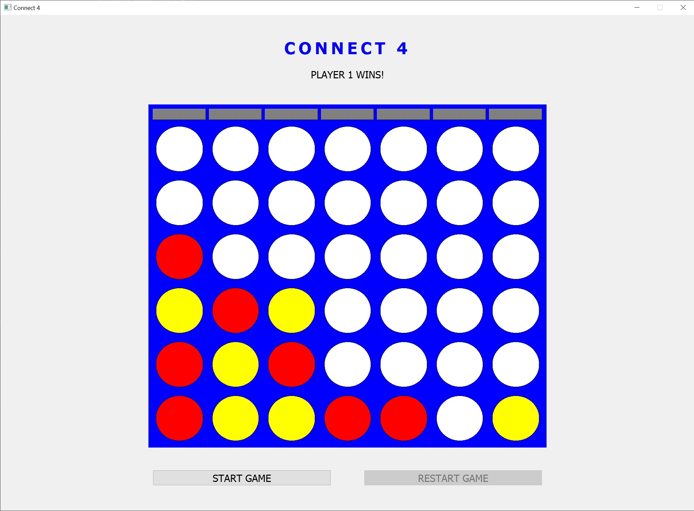
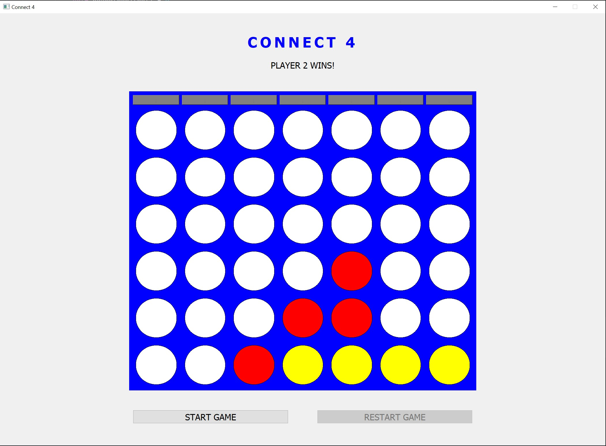
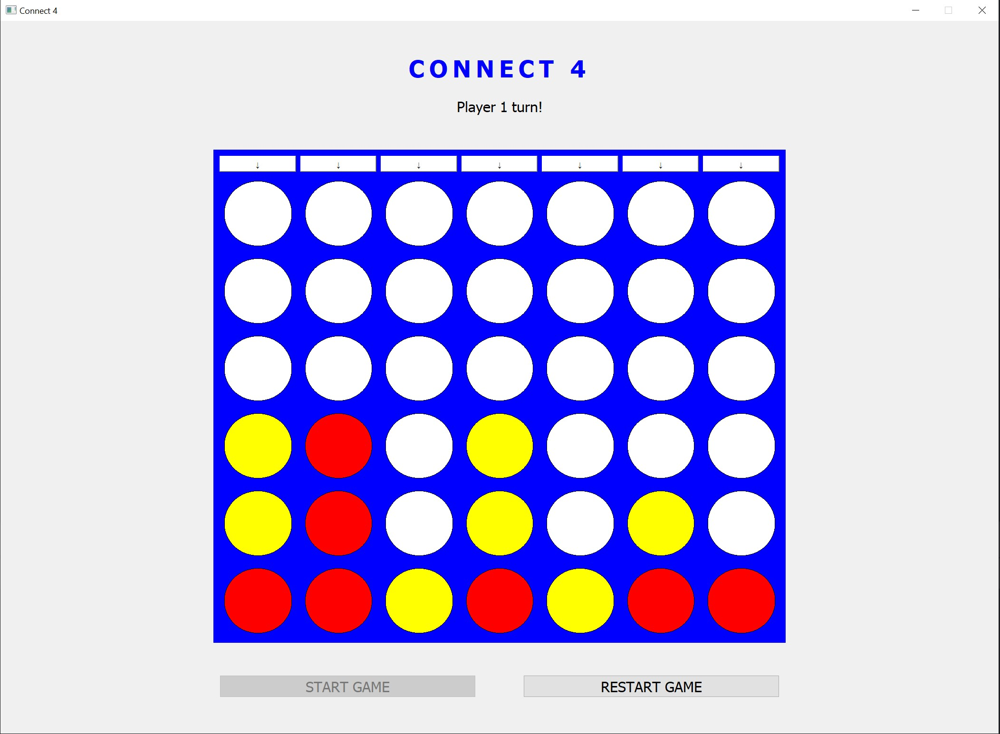

# Connect 4 - PyQt Edition

Connect 4 game built with Python and PyQt5. This project separates the game logic and UI for clarity and maintainability. It also includes screenshots of example gameplay to showcase the interface in action.

## Features

- Full Connect 4 gameplay with alternating turns
- Win detection (horizontal, vertical, diagonal)
- Interactive UI with buttons and labels
- Clean object-oriented separation between UI and logic

## Screenshots

<p float="left">
  
  
  
</p>

## Project Structure

```
Connect4/
├── Connect4.py                      # PyQt UI and main game flow
├── Board.py                         # Game board logic and win detection
├── Connect4.exe                     #  Standalone executable for Windows
├── imgs/
│   ├── connect4_img1.jpg            # Gameplay image 1
│   ├── connect4_img2.jpg            # Gameplay image 2
│   └── connect4_img3.jpg            # Gameplay image 3
└── README.md                        # Project documentation
```

## Notes

- The `.exe` file includes everything needed to play, so you don’t need Python or any external dependencies.
- Screenshots showcasing gameplay can be found in the `imgs/` folder.
